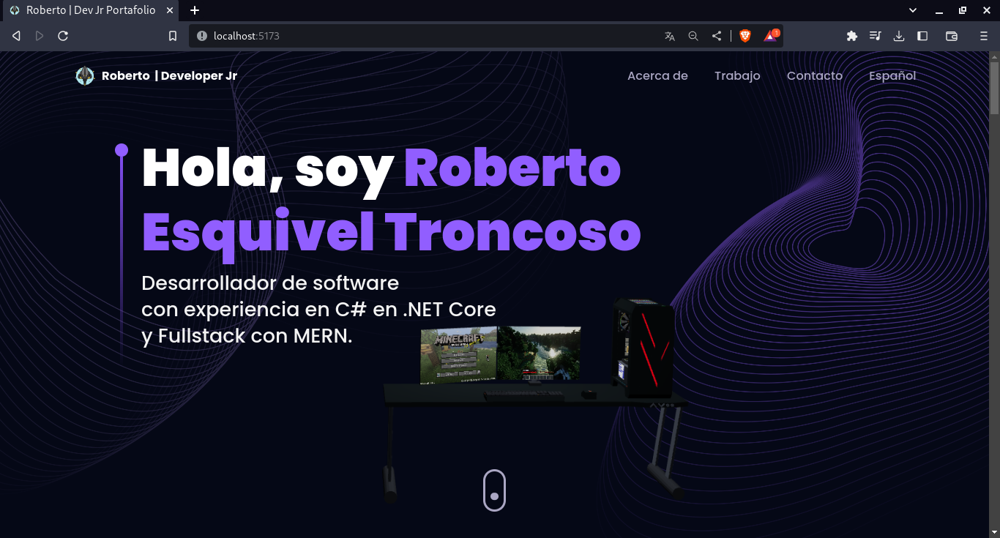

# Mi portafolio utilizando Three.js and React.js

https://github.com/RETBOT/retbot_portafolio/assets/71575985/fd968435-2f3f-44c8-91f6-bcc39a01e5b4

## Introducción

¡Bienvenido a mi portafolio en GitHub!

Pagina en linea: https://roberto-esquivel-troncoso.web.app/

Mi portafolio actualizado: https://roberto-esquivel-troncoso.netlify.app/

En este repositorio, encontrarás mi impresionante portafolio de Desarrollador 3D, donde utilizo Three.js y React.js para crear experiencias interactivas y visualmente impactantes.

### Tutorial de referencia

Este portafolio se basa en el tutorial del canal "JavaScript Mastery" en YouTube. Puedes encontrar el tutorial completo en el siguiente enlace: [Tutorial de JavaScript Mastery](https://youtu.be/0fYi8SGA20k). Este tutorial me proporcionó los conocimientos y las pautas necesarias para desarrollar mi portafolio utilizando Three.js y React.js.

### Características destacadas

- **Three.js**: Utilizo la potente biblioteca Three.js para renderizar y animar modelos 3D, creando mundos virtuales llenos de vida y realismo.

- **React.js**: Mi portafolio está construido con React.js, lo que me permite aprovechar su capacidad para crear componentes reutilizables y mantener un código limpio y organizado.

- **React Three Fiber**: Utilizo React Three Fiber, una biblioteca popular que facilita la integración de Three.js en aplicaciones de React. Esto me permite crear gráficos 3D de manera eficiente y efectiva.

- **TailwindCSS**: Para el diseño y estilo de mi portafolio, he utilizado TailwindCSS, un marco de trabajo CSS de utilidad que me permite crear interfaces elegantes y responsivas de manera rápida y sencilla.

- **Framer Motion**: He utilizado Framer Motion, una biblioteca de animación de React, para agregar animaciones y transiciones fluidas a mi portafolio, brindando una experiencia visualmente atractiva a los visitantes.

### Contenido del portafolio

En mi portafolio, encontrarás una variedad de proyectos que demuestran mis habilidades y conocimientos en el campo del desarrollo 3D. Estos proyectos incluyen:

- Modelado y animación de objetos en 3D.
- Visualización de datos en entornos tridimensionales.
- Experiencias interactivas y juegos en 3D.
- Aplicaciones web con efectos visuales y animaciones inmersivas.

Cada proyecto cuenta con una descripción detallada, capturas de pantalla y enlaces a las demostraciones en vivo cuando están disponibles.

### ¡Explora mi trabajo!

Te invito a explorar mi portafolio de Desarrollador 3D en GitHub. Siéntete libre de revisar los proyectos, clonar el repositorio y experimentar con el código. ¡Espero que encuentres inspiración y disfrutes de las experiencias interactivas que he creado utilizando Three.js y React.js!

No dudes en contactarme si tienes alguna pregunta o si estás interesado en colaborar en proyectos relacionados con el desarrollo 3D.

¡Gracias por visitar mi portafolio en GitHub! 
